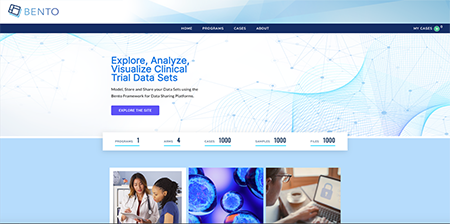
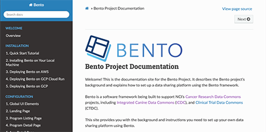

.. image:: source/assets/Bento-Header-Logo.png
   :width: 300px
   
|

===========================
Bento Project Documentation
===========================

Welcome! This is the documentation site for the Bento Project. It describes the Bento project's background and explains how to set up a data sharing platform using the Bento framework.

Bento is a software framework being built to support NCI’s `Cancer Research Data Commons <https://datascience.cancer.gov/data-commons>`_ projects, including `Integrated Canine Data Commons <https://datacommons.cancer.gov/repository/integrated-canine-data-commons>`_ (`ICDC <https://caninecommons.cancer.gov/#/>`_), and `Clinical Trial Data Commons <https://datacommons.cancer.gov/repository/clinical-trial-data-commons>`_ (CTDC).

This site provides you with the background and instructions you need to set up your own data sharing platform using Bento.

|

Checkout our example site using Bento framework! `Bento-tools <https://bento-tools.org/#/>`_

|

Bento Documentation: `https://cbiit.github.io/bento-docs/ <https://cbiit.github.io/bento-docs/>`_

GitHub: `https://github.com/CBIIT/bento-docs/ <https://github.com/CBIIT/bento-docs/>`_

