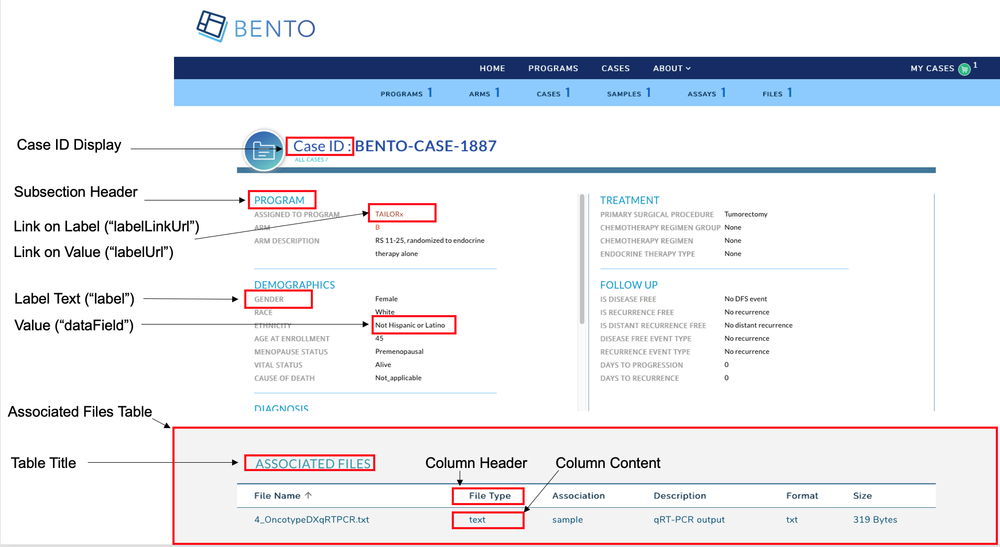

# Case Detail Page

## Introduction
The case detail page lists the set of cases in the Bento Commons.

## Prerequisites
1. Fork the GitHub repo `https://github.com/CBIIT/bento-frontend` (representing your GitHub username as `YOUR-USERNAME`)
2. Create a local clone of your fork into a local directory, represented here as `$(src)`.

&nbsp;

## Instructions
If no link is available from dashboard yet, case detail page can be reached on URL [http://localhost:3000/#/case/:case_id  ](http://localhost:3000/#/case/:case_id)

For example: http://localhost:3000/#/case/BENTO-CASE-1887

All custodian configurations are in file `src/bento/caseDetailData.js`.

&nbsp;

### Header area configuration:

* "**Case ID Display**" value: can be configured in constant `caseHeader.label`

### Subsection configuration:

* "**Subsection format and content**" subsections can be configured for left panel and right panel in array constants "leftPanelSubsections" and "rightPanelSubsections"
* Each **subsection** is represented by a JavaScript object, subsection display order is same as object order in the array.
  * "**Subsection Header**" can be set in property "sectionHeader"
  * "**Subsection Tex**t" can be set in property "sectionDesc"
* All Label-value pairs are in array property "properties", one object per pair. Display order is same as object order in the array
  * "**Label text**" can be set in property "label"
  * "**Value**" from which data field to display can be set in property "dataField"
* "**Link on Labe**l" can be set in property "labelLinkUrl"
* "**Link on Value**" can be set in property "linkUrl"
* URL can be static or contain dynamic value in the dataField, **space** holder "{}" in URLs will be replaced by actual value in the dataField

### File table configuration:

* "**Associated Files Table**" can be configured in object tableConfig
* "**Table Title**" can be set in property "title"
* If custodian wants to hide the table entirely, simply set property "display" to "false"
* "**columns**" can be configured in array property "columns", one object per column. "**column order**" is same as order in the array.
* "**Column Header**" can be set in property "header"
* "**Column Content**" can be set in property "dataField"
* "**Default Sort Order column**" can be set in property "defaultSortField", it should be the same value as "dataField" of the column custodian chose to be sorted by default.
* "**Default Sort direction**" can be set in property "defaultSortDirection"

