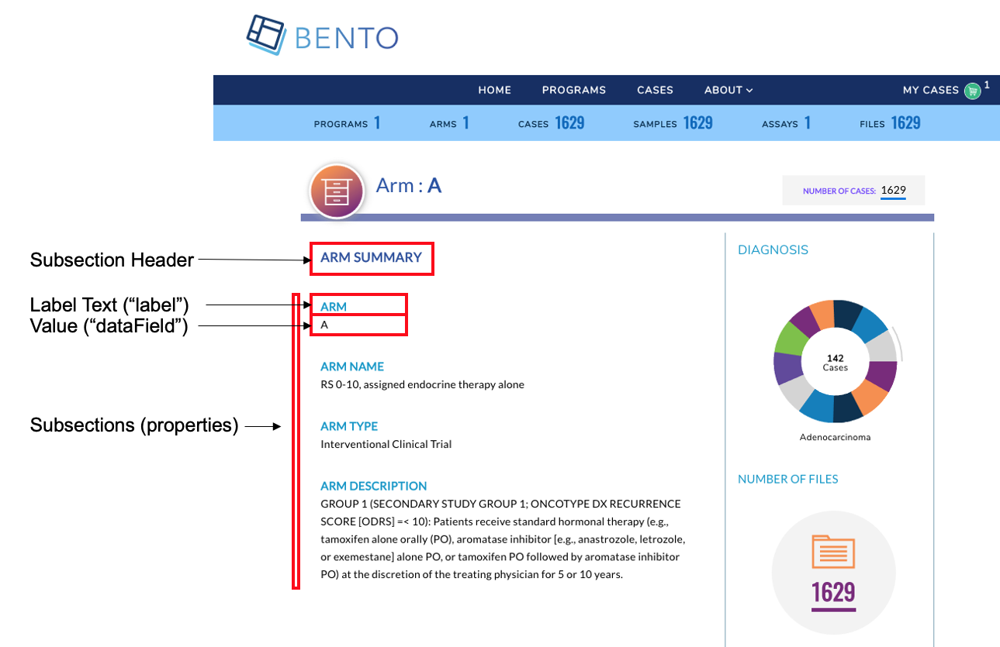

# The Study Arm Details Page
This page provides a summary of the Study Arm that belongs to a Program that participates in a Bento-based data sharing platform.



**Study Arm Details Page**. Displayed are the configurable components of the Study Arm Details Page.


## Prerequisites

1. The files that specify the configuration parameters of the Study Arm Details Page are stored in the GitHub `https://github.com/CBIIT/bento-frontend` (representing your GitHub username as `YOUR-USERNAME`). Create a local clone of your fork into a local directory, represented in these instructions as `$(src)`.

2. Configuration Parameters for all Study Arm Details Page Elements can be specified in the file: `$(src)/packages/bento-frontend/src/bento/armDetailData.js`.


3. All images and icons used in a Bento instance should be accessible via a public url. 

4. Please review the list of [GraphQL queries](https://github.com/CBIIT/bento-RI-backend/blob/master/src/main/resources/graphql/bento-extended-doc.graphql) to select query type(s) that return data of interest.


## Configuring the Study Arm Details Page

Key study arm attributes can be added to the Study Arm Details Page as label:value pairs within a set of subsections (See Step 3. below). A maximum of **6** sections can be added to the Study Arm Details page. Within each subsection a maximum of **10** attributes can be displayed as label:value pairs. 

An optional table can be added to the Study Arm Details Page to list arm-level metadata.

1. Open the file `$(src)/packages/bento-frontend/src/bento/armDetailData.js`.
2. Under `header`:
    * Set the field `label` to the display label for the Study Arm Details page.
    * Set the field `dataField` to the GraphQL API query that returns the value, such as the Arm Name or Arm ID to be displayed.
3. Under `subsections`:
    * For each label:value pair to be displayed, create an object {label: ,datafield: ,} in `properties`:
        * Set the field `label` to the display label for the attribute.
        * Set the field `dataField` to the GraphQL API query that returns the data to be displayed as a value for the given label:value pair.
        * Optional links can be embedded in the label or value, or both. Links can be internal or external. 
            * To add a link to the *value* specify an internal or external link by adding a `link` attribute to the object. 
            * To add a link to the *label* specify an internal or external link by adding a `labelLink` attribute to the object.
    * Add the GraphQL API query field to `GET_ARM_DETAIL_DATA_QUERY`. 

> ⚠️ **WARNING**: If more than 6 subsections are configured, **only the first 6 subsections will be displayed in the UI, other subsections will be ignored**. 
>
> ⚠️ **WARNING**: If more than 10 properties are configured, **only first 10 properties will be displayed in the UI, other properties will be ignored**. 


## Configuring the Study Arm Details Page Table

A table can be added to the Study Arm Details Page. *This is optional.*
1. Open `$(src)/packages/bento-frontend/src/bento/armDetailData.js`.
2. In `filesTable`:
  * The `display` field is set to true, by default. *Set this field to false to disable the table in the Arm Details page*.
  * Set the field `title` to the desired title.
  * Set the field `dataField` to the name of the GraphQL API query being used to return data for the Arm Details page. *Note: This query should match the GraphQL API query in `GET_ARM_DETAIL_DATA_QUERY`*.
  * Set the field `defaultSortField` to the name of the query field that will be used to sort the Arm Details page table. Note: this query field should be displayed as one of the columns in the Arm Details page table.
  * Set the field `defaultSortDirection` to the sort order to be displayed. Valid values are 'asc' (ascending) and 'desc' (descending).
  * Add the GraphQL API query to `GET_ARM_DETAIL_DATA_QUERY`.
3. Example:

```javascript
const filesTable = {
  display: true,
  title: '<Table Title>',
  dataField: '<GraphQL API query returning data for this page>',
  defaultSortField: '<GraphQL API query field used to sort the table.>',
  defaultSortDirection: '<sort order, asc|desc>',
...
const GET_ARM_DETAIL_DATA_QUERY = gql`{
  '<Your GraphQL query>'' {
    '<Data fields returned by your GraphQL API query>'
  ... 
 }
}
```


### Adding Columns to the Study Arm Details Page Table

Up to 10 columns can be added to the Study Arm Details Page Table. If adding more than 10 columns, **Bento will display the first 10 columns without an error or warning message**. The top-down order of columns will be displayed left to right on the UI.

1. Open `$(src)/packages/bento-frontend/src/bento/armDetailData.js`.
2. Under `filesTable`, add an object `{dataField: , header: , link: ,}` to the `columns` list:
  * Set the field `dataField` to the GraphQL API query data field that returns the data for the column.
  * Set the field `header` to the column header name.
  * Set the field `link` to an internal or external link that is to be embedded into the the column value. See below for additional instructions on adding internal and external links. *Links are optional*.
  * Add the GraphQL API query data field to `GET_ARM_DETAIL_DATA_QUERY`.
3. Example:

```javascript
const filesTable = {
  ...
  columns: [
    {
      dataField: '<GraphQL API query field returning data for this column>',
      header: '<Column Header>',
      link: '<link to be embedded in column value>',
    },
    {
      dataField: '<GraphQL API query field returning data for this column>',
      header: 'PubMed ID',
    },
    ...
  ],
};

const GET_ARM_DETAIL_DATA_QUERY = gql`{
  '<Your GraphQL query>'' {
    '<Data fields returned by your GraphQL API query>'
  ... 
 }
}
```

##### Internal Links in the Study Arm Details Page Table
1. links starting with `/` are considered as internal links.
2. Internal links will be opened in the same tab.
3. Dynamic links can be generated by passing a valid table field to `{}`. For example, `/program/{program_id}` will; link to `program/NCT00310180`.

##### External Links in the Study Arm Details Page Table
1. External links should start with `http://` or `https://`.
2. External links should show-up with `externalLinkIcon`. Note: In this version of Bento the External Link Icon of the Arm Details page is not configurable.
3. External link will be opened in a new tab.
4. Dynamic links can be generated by passing a valid table filed to `{}`. 
   For example, `https://pubmed.ncbi.nlm.nih.gov/{pubmed_id}` will link to `https://pubmed.ncbi.nlm.nih.gov/29860917/`

> ⚠️ **WARNING**: A maximum of **10** columns can be added to the table. If adding more than 10 columns, Bento will display only the first ten columns, without any warning or error message


## Configurating the Associated Files Table

This table lists files that are associated with a Study Arm.  It can be configured as follows:

1. Open `$(src)/packages/bento-frontend/src/bento/armDetailData.js` 
2. Edit the  `filesTable` object :
* **`display`**:  Show  or Hide column (must be `true`  or `false`)

* **`tableTitle`** : Text to show on table title

* **`subjectDetailField`** : field name in "Data" object to get values for table. Field name for files / Samples data, need to be updated only when using a different GraphQL query 

* **`defaultSortField`**: Value must be one of the 'dataField' in columns.

* **`defaultSortDirection`**: Sort default column in Ascending or Descending order (value must be `asc` or `desc`)

* **`buttonText`**: Text to appear on Add to cart button

* **`tooltipMessage`** **:** Help Icon Message.

* **`columns`**: a list of column objects. There is a maximum limit of 10 columns. If more than 10 columns are added, Bento will display the first 10 columns without an error or warning message. The top-down order of columns will be displayed left to right on the UI. Each column object is described by the following fields:

  * **`dataField`**: specifies what data appears in the column, field must be from the GraphQL API query

  * **`header`**: Heading Text for column

  * **`sort`**: sort order for column; must be `asc` or `desc`

  * **`primary`**: applies to primary field of table like "sample_ID" or "File_ID" based on which files will be added in to cart; must be `true`  or `false`

  * **`display`**: Show  or Hide column; must be `true`  or `false`

  * **`dataFromRoot`**: Get data from parent element; must be `true`  or `false`

  * **`link`**: Hyperlink to internal or external page. The value can be injected in link dynamically using `{datafield}`, for example:

    ```javascript
    // Internal Link 
    link: '/arm/{dataField}',
    
    // External Link
    link: 'https://example.com/{dataField}',
    ```

     ##### Internal Links in the Explore Dashboard Table

    1. links starting with `/` are considered as internal links.
    2. Internal links will be opened in the same tab.
    3. Dynamic links can be generated by passing a valid table field to `{}`. For example, `/program/{program_id}` will link to `program/NCT00310180`.

    ##### External Links in the Explore Dashboard Table

    1. External links should start with `http://` or `https://`.
    2. External links should show-up with `externalLinkIcon`.
    3. External link should be opened in a new tab.
    4. Dynamic links can be generated by passing a valid table filed to `{}`.
       For example, `https://pubmed.ncbi.nlm.nih.gov/{pubmed_id}` will link to `https://pubmed.ncbi.nlm.nih.gov/29860917/`

  >  ⚠️ **WARNING**: A maximum of **10** columns can be added to the table. If adding more than 10 columns, Bento will display only the first ten columns, without any warning or error message


### GraphQL Queries to Power Tables

The GraphQL Query used for the Associated Files Table is defined in `GET_ARM_DETAIL_DATA_QUERY`. For example:

```javascript
// GraphQL query to retrieve detailed info for a case
const GET_ARM_DETAIL_DATA_QUERY = gql`
  query armDetail($study_acronym: String) {
    armDetail(study_acronym: $study_acronym) {
      study_acronym
      study_name
      study_type
      study_full_description
      study_info
      num_subjects
      num_files
      num_samples
      num_lab_procedures
      diagnoses {
        group
        subjects
      }
 `;
```

