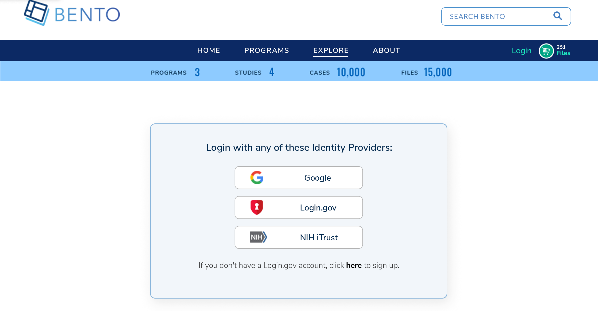

# Authentication

## Introduction
The Bento Framework provides an OIDC-compliant authentication (AuthN) service so that Bento-based platforms have the ability to authenticate users. Authentication can be enabled or disabled. Bento currently supports several identity providers (IdPs) and a single IdP or multiple IdPs can be configured for any given Bento platform. The configured IdPs will appear on the Bento login page and will allow users to authenticate with a given IdP if they have a registered identity with that provider. The default behavior will redirect any unauthenticated users to the login page if attempting to access protected pages. Google is the default IdP.

&nbsp;

## Prerequisites
1. The files that specify the configuration parameters for authentication are stored in the GitHub repository `https://github.com/CBIIT/bento-frontend`. Create a local clone of your fork into a local directory, represented in these instructions as `$(src)`.

2. Configuration parameters for authentication elements can be specified in the file: `$(src)/bento-frontend/src/bento/siteWideConfig.js`.

&nbsp;

## Configuring Authentictation
Authentication can be enabled or disable for any Bento-based system.
1. Edit file: `$(src)/bento-frontend/src/bento/siteWideConfig.js`
2. Set the field `enableAuthentication` to True or False

## Configuring an Identity Provider
Supported IdPs can be enabled or disabled.
1. Edit file: `$(src)/bento-frontend/src/bento/siteWideConfig.js`

2. Set the field `authEndPoint` to google, NIH, or login.gov

