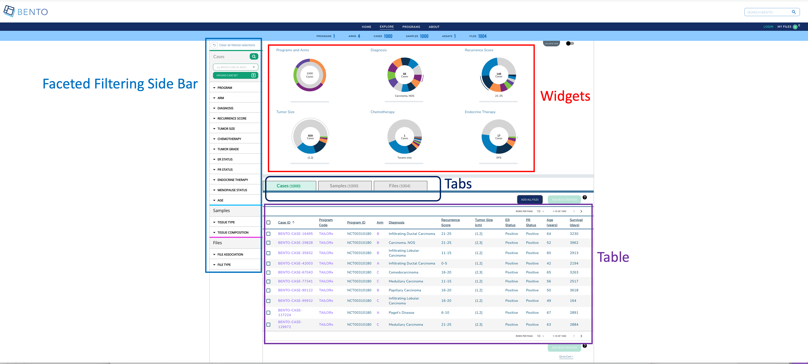

# Dashboard
The Dashboard provides the end user with several capabilities (a) filter data entities of interest via faceted filtering (b) view graphical summaries of data entities and (c) select data entities for further exploration.



**Dashboard**. Displayed are the configurable elements of a Bento Dashboard: widgets, faceted filtering, table, and tabs.

### Prerequisites

1. The files that specify the configuration parameters of the Dashboard are stored in the GitHub `https://github.com/CBIIT/bento-frontend` (representing your GitHub username as `YOUR-USERNAME`). Create a local clone of your fork into a local directory, represented in these instructions as `$(src)`.

2. Configuration parameters for Dashboard elements can be specified in the file: `$(src)/packages/bento-frontend/src/bento/dashTemplate.js`.

3. All images and icons that you use in your Bento instance should be accessible via a public url.

4. Please review the list of [GraphQL queries](https://github.com/CBIIT/bento-backend/blob/master/src/main/resources/graphql/bento-extended-doc.graphql) to select query types that return your data of interest.

## Configuring the Dashboard Widgets
Dashboard Widgets provide a graphical summary of the key data entities in your data sharing platform. In this version of Bento, you can add 3, 4 or 6 widgets. If you add more than **6** widgets, Bento will display the first 6 widgets without any error or warning message.

1. Open `$(src)/packages/bento-frontend/src/bento/dashTemplate.js`.
2. Under `widgetConfig` add an object `{ type, label, dataName, ... }` to represent your widget.
	* Set the field `type` to the type of widget you want to display. Valid values are *'donut'* and *'sunburst'*.
	* Set the field `title` to the display title for your widget.
	* Set the field `dataName` to the name of the GraphQL API query that returns data for your widget.
	* Sunburst widgets display two types of data within a single plot. *If your widget is of type 'sunburst'*, set the fields `datatable_level1_field` and `datatable_level2_field` to the specific fields in the GraphQL API query that returns data for your sunburst. The field `datatable_level1_field` drives the inner ring of of the sunburst. The field `datatable_level2_field` drives the outer ring of of the sunburst.
	* Sunburst widgets allow the custodian to override the default color schemes. Set the fields `datatable_level1_colors` and `datatable_level2_colors` to override the default colors for the inner and outer rings of the widget, respectively. These fields should contain arrays of colors in hex format with no minimum or maximum number of entries. Colors will be repeated if there are more data points than colors in the array.
	* Enter all GraphQL API queries that drive the widgets in `GET_DASHBOARD_DATA_QUERY`.
3. Example:

```javascript
export const widgetConfig = [
  {
    type: 'sunburst',
    title: '<Widget Label>',
    dataName: '<GraphQL API query that returns data for widget>',
    datatable_level1_field: '<GraphQL field for inner ring>',
    datatable_level1_colors: ['#eee', '#ddd', '#ccc']
    datatable_level2_field: '<GraphQL field for outer ring>',
    datatable_level2_colors: ['#fff', '#000', '#ccc'],
  },
  {
    type: 'donut',
    title: '<Widget Label>',
    dataName: '<GraphQL API query that returns data for widget>',
  },
];

// ...
export const GET_DASHBOARD_DATA_QUERY = gql`{
 GraphQL API query{
 	API query field
 }
};
```

## Configuring Faceted Filtering

The dashboard's facet filters allow an end user to search for data of interest by applying multiple filters, based on faceted classification of stored data entities.

The faceted filtering on the dashboard's side bar can be organized into into facet sections, each with a maximum count of 15 facets that are associated with facet values that can be used for filtering data upon selecting the respective checkboxes.


### Configuring Facet Sections

- Open the configuration file located at `bento-frontend/src/bento/dashTemplate.js` (in the "CBIIT/bento-frontend" git repo)

The variable `facetSectionVariables` controls the sections available in the facet filtering sidebar. Each section is defined as follows:

- `isExpanded`: controls if the section is expanded or collapsed by default (must be `true` or `false`)

- `hasSearch`: controls if the section displays the Local Find search bar (must be `true` or `false`)

For Example:

```javascript
export const facetSectionVariables = {
  Cases: {
    isExpanded: true,
    hasSearch: true,
  },
  Samples: {
    isExpanded: true,
  },
  // ... other facet sections
};
```

### Configuring Facet Filters

- Open the configuration file located at `bento-frontend/src/bento/dashTemplate.js` (in the "CBIIT/bento-frontend" git repo)

- To represent your facet, edit or create a facet object under the `facetsConfig` object

- Each facet is defined as follows:

  - `section`: the facet section that the facet should appear in the sidebar. Default options include: `CASES`, `SAMPLES`, `FILES`.

  - `label`: the display label for your facet that appears in the sidebar

  - `field`: the specific field in the GraphQL API query, as the  `api`

  - `api`:  the GraphQL api query:  `GET_DASHBOARD_DATA_QUERY`  returns data for your facet.  (It is in the same file: `dashboardData.js`)

 - `datafield`: the variable used to cross-reference/pass data to widgets and dashboard data tables,  see: `bento-frontend/src/bento/dashboardTabData.js` (described in [Dashboard: Tabs and Tables](dashboard-tabs-and-tables.md))

  - `show`: controls if the facet is displayed or hidden (must be `true` or `false`)

  - **Note** that the order of the facet sections and individual facets nested in each facet section is controlled by the order of the entries of the facets in the `facetsConfig` object

For Example:

```javascript
export const facetsConfig = [
  {
    section: CASES,
    label: 'Program',
    apiPath: 'subjectCountByProgram',
    apiForFiltering: 'filterSubjectCountByProgram',
    datafield: 'programs',
    field: GROUP,
    type: InputTypes.CHECKBOX,
    sort_type: sortType.ALPHABET,
    show: true,
  },
  {
    section: CASES,
    label: 'Arm',
    apiPath: 'subjectCountByStudy',
    apiForFiltering: 'filterSubjectCountByStudy',
    datafield: 'studies',
    field: GROUP,
    type: InputTypes.CHECKBOX,
    sort_type: sortType.ALPHABET,
    show: true,
  },
  {
    section: SAMPLES,
    label: 'Tissue Composition',
    apiPath: 'subjectCountByTissueComposition',
    apiForFiltering: 'filterSubjectCountByTissueComposition',
    datafield: 'composition',
    field: GROUP,
    type: InputTypes.CHECKBOX,
    sort_type: sortType.ALPHABET,
    show: true,
  },
  {
    section: FILES,
    label: 'File Association',
    apiPath: 'subjectCountByFileAssociation',
    apiForFiltering: 'filterSubjectCountByFileAssociation',
    datafield: 'association',
    field: GROUP,
    type: InputTypes.CHECKBOX,
    sort_type: sortType.ALPHABET,
    show: true,
  },
];
```

**NOTE**:  Update the GraphQL API Query in `GET_DASHBOARD_DATA_QUERY` as needed; it should contain all queries and fields that are associated with your facets

## Configuring Dashboard Tables & Tabs

The dashboard is structured to organize the data tables using tabs beneath the widgets. The Dashboard Table can be configured to list key data entities in your data sharing platform along with a list of key data entity attributes. In the [Bento reference implementation](https://bento-tools.org/#/cases) the Dashboard Table lists the cases (or study subjects) in the program.


The tabs can be configured as follows:

1. Open `$(src)/packages/bento-frontend/src/bento/dashboardTabData.js`
2. To change Properties of tab go to `tabContainers` object:
- **`name`** : Text to show on tab
- **`dataField`**: specifies what data appears in the column, field must be from the GraphQL API query

**NOTE**: the order of the entries in `tabs` should match the order in the `tabsIndex` object. This is the order that the tabs will be displayed left to right on the UI.

To change the style of the tabs go to `tabIndex` object:

-  **`title`** : Text to shown on tab
-  **`primaryColor`** : background color when tab is selected
-  **`selectedColor`** : font color when tab is selected

**NOTE**: the order of the entries in `tabIndex` should match the order in the `tabs` object. This is the order that the tabs will be displayed left to right on the UI.

The tables displayed in each tab can be configured as follows:

1. Open `$(src)/packages/bento-frontend/src/bento/dashboardTabData.js`
2. The `tabContainers` object is an array of tables, with each table object having the following fields:

- **`dataField`** : field name in "Data" object to get values for table.

 **NOTE**: This field should be in the GraphQL API query specified in the `api` field.

- **`defaultSortField`**: Value must be one of the 'dataField' in columns.

- **`defaultSortDirection`**: Sort default column in Ascending or Descending order (value must be `asc` or `desc`)

- **`buttonText`**: Text to appear on Add to cart button

- **`saveButtonDefaultStyle`**: Style of on Add to cart button, with fields such as

          color: '#fff',
          backgroundColor: '#09A175',
          opacity: '1',
          border: '0px',
          cursor: 'pointer',

- **`ActiveSaveButtonDefaultStyle`**: Style of on Add to cart button when it is active mode

- **`DeactiveSaveButtonDefaultStyle`**: Style of on Add to cart button when it is disabled mode

- **`columns`**: a list of column objects. There is a maximum limit of 10 columns. If more than 10 columns are added, Bento will display the first 10 columns without an error or warning message. The top-down order of columns will be displayed left to right on the UI.  Each column object  is described by the following fields:

  * `dataField`: specifies what data appears in the column, field must be from the GraphQL API query

  * `header`: Heading Text for column

  * `sort`: sort order for column

    * must be `asc` or `desc`

  * `primary`: applies to primary field of table like "sample_ID" or "File_ID" based on which files will be added in to cart.

    * must be `true`  or `false`

  * `display`: Show  or Hide column

    * must be `true`  or `false`

  * `dataFromRoot`: Get data from parent element.

    * must be `true`  or `false`

  * `link`: Hyperlink to internal or external page. The value can be injected in link dynamically using `{datafield}`, for example:

    ```javascript
    // Internal Link
    link: '/arm/{dataField}',

    // External Link
    link: 'https://example.com/{dataField}',
    ```

     ### Internal Links in the Dashboard Table

    1. links starting with `/` are considered as internal links.
    2. Internal links will be opened in the same tab.
    3. Dynamic links can be generated by passing a valid table field to `{}`. For example, `/program/{program_id}` will link to `program/NCT00310180`.

    ### External Links in the Dashboard Table

    1. External links should start with `http://` or `https://`.
    2. External links should show-up with `externalLinkIcon`.
    3. External link will be opened in a new tab.
    4. Dynamic links can be generated by passing a valid table filed to `{}`.
       For example, `https://pubmed.ncbi.nlm.nih.gov/{pubmed_id}` will link to `https://pubmed.ncbi.nlm.nih.gov/29860917/`

  >  :warning: **WARNING**: You can add a maximum of **10** columns to the dashboard tab table. If you add more than 10 columns, Bento will display only the first ten columns, without any warning or error message


### Tool Tips

To change Properties of tool tip for each tab, table go to `tooltipContent` object:

- **`icon`**: The help tip icon that appears next to the 'add button'
- **`alt`**: alt for the tooltip image
- **`0,1,2`**: tooltip content for first tab, second tab and third tab.


### GraphQL Queries

The GraphQL Query used in the Dashboard page is defined in `DASHBOARD_QUERY`. For example:

```javascript
// GraphQL query to retrieve detailed info for a case
export const DASHBOARD_QUERY = gql`{
  numberOfPrograms
  numberOfStudies
  numberOfSubjects
  numberOfSamples
  numberOfLabProcedures
  numberOfFiles
  subjectCountByProgram{
        group
        subjects
      }
...
    fileOverview {
        file_id
        file_name
        association
        file_description
        file_format
        file_size
        program
        arm
        subject_id
        sample_id
        diagnosis
    }
  }`;
```

### Suggested Best Practices

- Dimension of the External Link Icon = 16 X 16 pixels.
- All images should have a resolution >= 72 ppi and should be in the PNG format.
