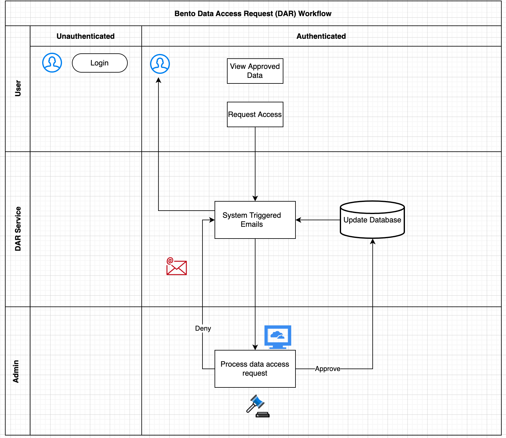

# Data Access Request (DAR) Service

*Service only available for cloud installations of the Bento Framework*

## Introduction

The Bento Framework supports a user-driven data access request workflow that enables authenticated users to request access to a specific dataset or resource (ie. arm, study, project, program, etc.) and allows system administrators to review, approve, and reject data access requests submitted by users. System triggered emails are generated at each definitive point in the workflow. Admins can navigate the data access request workflow using the Bento Admin Portal.

  


  



  

<p>&nbsp;</p>

  
  

## Prerequisites

1. The files that specify the configuration parameters for the DAR service are stored in the GitHub repository `https://github.com/CBIIT/bento-frontend`. Create a local clone of your fork into a local directory, represented in these instructions as `$(src)`.

  

2. Configuration parameters for node-level access can be specified in the file: `$(src)/packages/bento-frontend/public/injectEnv.js`.

  

3. Configuration parameters for DAR form elements can be specified in the file: `$(src)/bento-frontend/src/bento/requestAccessData.js`.

  

<p>&nbsp;</p>

  

## Configuring Node-Level Access

Access to data can be controlled as a single entity or at the node level. Controlling data at the node level requires a node from the data model to be identified and specified upon initial set up of the respective data commons.

### Node-Level_Access

	* Acceptable values are True or False. The default value is True.

	* If value is True, data access is controlled at the node-level and the Node_Label parameter must be specified.

	* If value is False, there is no ability to control data access at the node-level and instead users will either have access to all of the data or none of the data based upon authentication and authorization.

  

### Node_Label

	* The label displayed on the user interface that is used to represent the node that governs data access granularity.

	* Acceptable values are any string with a max length of 30 characters. The default is Study Arm(s).

### Example

Edit file: `$(src)/packages/bento-frontend/public/injectEnv.js`

1. Update fields: NODE_LEVEL_ACCESS and NODE_LABEL

```javascript

window.injectedEnv = {
	NODE_LEVEL_ACCESS: true,
	NODE_LABEL: 'Study Arm(s)',
}
```
> Note: NODE_LABEL is just a label property and does not restrict users on any specific node. The configuration for that needs to be done in the backend at the time of project initialization. 


## UI Configuration(s)
**File Location:** `$(src)/bento-frontend/src/bento/requestAccessData.js`

This is a configuration file for the Data Access Request page. Custodians can use this file to make changes to the page's look and feel.

### Usage
To use this configuration, follow these steps:

1. Import the pageTitle and formFields variables from this file into your code.
2. Implement the DataAccessRequest component in your code using the formFields configuration object.
3. Customize the page's look and feel by making changes to the formFields object.

### Configuration
The configuration for the Data Access Request page includes the following variables:

#### `pageTitle`
This sets the title of the page. By default, it is set to 'Data Access Request'.

#### `aclAPIOptionsField (optional)`
This is a string that specifies the name of the API field from which the Access Levels Controls (ACL) should be read. If this field is present, the program will read the ACL from the API instead of from the options property of the armIDs field in the formFields array. By default, this is set to 'listArms'.

#### `formFields`
This is an array of objects that define the fields in the Data Access Request form. Each object has the following properties:

* **id**: a unique identifier for the field.
* **type**: the type of the input field. Currently supported types are **'textBox'** and **'aclDropdown'**.
* **required**: a boolean indicating whether the field is required.
* **label**: the label for the field.
* **placeHolder**: the placeholder text for the field.
* **display**: a boolean indicating whether the field should be displayed on the form.
* **optionsAPIField**: (optional) a string indicating the name of the API field that contains the options for an ACL dropdown field. If this field is not present, the options will be read from the options property.
* **options**: an array of objects that define the options for an ACL dropdown field. Each object has the following properties:
    * **id**: a unique identifier for the option.
    * **name**: the name of the option.

If **aclAPIOptionsField** is not present, the program will read the ACL options from the **options** property of the **armIDs** field in the **formFields** array.

### Customization
To customize the Data Access Request page, changes can be made to the **formFields** object. Fields can be added, removed, or modified as needed. For example, a new field for the user's email address could be displayed by adding the following object to the **formFields** array:

```javascript
{
  id: 'email',
  type: 'textBox',
  required: true,
  label: 'Email Address',
  placeHolder: 'Email Address',
  display: true,
}
```

The **options** for the ACL dropdown field can be modified by changing the objects in the options array. For example, modifying the name of option A to **'A: RS 0-10, assigned endocrine therapy alone (default)'** by changing the following object:

```javascript
{
  id: 'a',
  name: 'A: RS 0-10, assigned endocrine therapy alone (default)',
}
```
> Note: If the **aclAPIOptionsField** field is not defined in the configuration file, the program will read the list of Access Levels Controls (ACL) from the **options** field under the **armIDs** object in the **formFields** array. If the **aclAPIOptionsField** field is defined, the program will ignore the **options** field and read the list of ACLs from the specified field in the API response.

