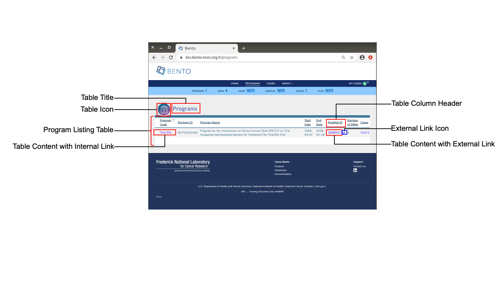

# The Programs Page
The Programs Page lists the programs that store data in a Bento-based data sharing platform equipped with multiple configurable components. See below for details.



**Programs Page**. Displayed are the configurable elements of a Bento Programs Page. These are: Table Title, Table Icon, Table Column Headers, Table Content, embedded Internal and External URLs and External Link Icon.

### Prerequisites

1. The files that specify the configuration parameters of the Programs Page are stored in GitHub `https://github.com/CBIIT/bento-frontend` (representing your GitHub username as `YOUR-USERNAME`). Create a local clone of your fork into a local directory, represented in these instructions as `$(src)`.

2. Configuration parameters for all Programs Page Elements can be specified in the file: `$(src)/packages/bento-frontend/src/bento/programData.js`.

3. All images and icons used in a Bento instance should be accessible via a public url. 

4. Please review the list of [GraphQL queries](https://github.com/CBIIT/bento-backend/blob/master/src/main/resources/graphql/bento-extended-doc.graphql) to select query type(s) that return the data of interest.

## Icons in the Programs Page.
There are two configurable icons in the Programs Page: (a) the Table Icon, that is a visual represenation of the Programs Table and (b) the External Link Icon that is a visual representation of an external link.

### Configuring the Icons in the Programs Page.
1. Open `$(src)/packages/bento-frontend/src/bento/programData.js`.
2. Under `programListingIcon`:
	* Set the field `src` to the URL of the table icon image file.
	* Set the fild `alt` to the ALT tag for the table icon.
3. Under `externalLinkIcon`:
	* Set the field `src` to the URL of the external link icon image file.
	* Set the field `alt` to the ALT tag for the external link icon.
4. Example: 

```javascript
const programListingIcon = {
  src: 'URL for your Table Icon',
  alt: 'ALT tag for your Table Icon',
};

const externalLinkIcon = {
  src: 'URL for your External Link Icon',
  alt: 'ALT tag for your External Link Icon',
};
```

## The Programs Page Table
The table in the Programs page lists the programs that store data in a Bento-based data sharing platform.

### Configuring the Programs Page Table.
1. Open `$(src)/packages/bento-frontend/src/bento/programData.js`.
2. In `table`:
	* The `display` field is set to true, by default. *Set this field to false to disable the table in the Programs Page*.
	* Set the field `title` to the the title of the table.
	* Set the field `dataField` to the name of the GraphQL API query being used to return data for the Programs Page. *Note: This query should match the GraphQL API query in `GET_PROGRAMS_DATA_QUERY`*.
	* Set the field `defaultSortField` to the name of the query field that will be used to sort the Programs Page table. Note: this query field should be displayed as one of the columns in the Program Page table.
	* Set the field `defaultSortDirection` to the sort order to be displayed. Valid values are 'asc' (ascending) and 'desc' (descending).
	* Add the GraphQL API query to `GET_PROGRAMS_DATA_QUERY`.
3. Example:

```javascript
...
const table = {
  display: true,
  title: '<Table Title>',
  dataField: '<GraphQL API query returning data for this page.>',
  defaultSortField: '<GraphQL API query field used to sort the table.>',
  defaultSortDirection: '<sort order, asc|desc>',
 ...
 };
const GET_PROGRAMS_DATA_QUERY = gql{
  '<Your GraphQL query>'' {
  	'<Data fields returned by your GraphQL API query>'
	... 
 }
};
```

### Adding Columns to the Programs Page Table
Up to 10 columns can be added to the Programs Page table. If you add more than 10 columns, **Bento will display the first 10 columns without an error or warning message**. The top-down order of columns will be displayed left to right on the UI.
1. Open `$(src)/packages/bento-frontend/src/bento/programData.js`.
2. Under `table`, 
   * Add an object {dataField:, header: , link: } to `columns`:
	  * Set the field `dataField` to the GraphQL API query data field that returns the data for the column.
	  * Set the field `header` to the column header name.
	  * Set the field `link` to an internal or external link that is to be embedded into the the column value. See below for additional instructions on adding internal and external links. *Links are optional*.
	* Add your GraphQL API query data field to `GET_PROGRAMS_DATA_QUERY`.
3. Example:

```javascript
const table = {
  ...
  columns: [
    {
      dataField: '<GraphQL API query field returning data for this column>',
      header: '<Column Header>',
      link: '<link to be embedded in column value>',
    },
    {
      dataField: '<GraphQL API query field returning data for this column>',
      header: 'PubMed ID',
    },
    ...
  ],


};

const GET_PROGRAMS_DATA_QUERY = gql`{
  '<Your GraphQL query>'' {
  	'<Data fields returned by your GraphQL API query>'
	... 
 }
}
```


#### Internal Links in the Programs Page Table
1. Links starting with '/' are considered as internal links.
2. Internal links will be opened in the same tab.
3. Dynamic links can be generated by passing a valid table field to '{}'. For example, '/program/{program_id}' shall link to 'program/NCT00310180'.

#### External Links in the Program Page Table.
1. External links shall start with 'http://' or'https://'.
2. External links shall show-up with 'externalLinkIcon'.
3. External link shall be opened in a new tab.
4. Dynamic links can be generated by passing a valid table filed to '{}'. 
   For example, 'https://pubmed.ncbi.nlm.nih.gov/{pubmed_id}' shall link to 'https://pubmed.ncbi.nlm.nih.gov/29860917/'.

## Suggested Best Practices
- Dimension of the Program Listing Icon= 100 X 100 pixels.
- Dimension of the External Link Icon = 16 X 16 pixels.
- All images should have a resolution >= 72 ppi and should be in the PNG format.
